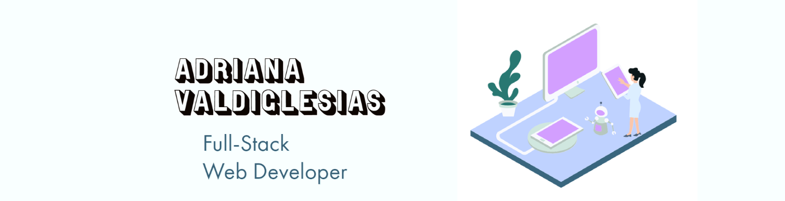

### Hi I'm Adriana-@Adrianavv1  

 

Beginners mindset and curiosity 💖

- 🔭  I’m currently working on: [Facebook Clone2.0](https://github.com/adrianavv1/fb-clone-2-yt)
- 🌱  I’m currently learning: UX Design through Grow with Google; & Python
- How to reach me: 
- 📫 Email: adrianavvaldi12@gmail.com
- 👩‍💻  Technologies I use: HTML, CSS, Tailwind CSS, Material UI, Next JS, Javascript, React, JSON, Web APIs, Express, MongoDB, SQL
- ✨  Fun fact: I am a bookworm 📔 

🏡 [portfolio](https://adrianavv1.github.io/My-portfolio/) |  
💡 [LinkedIn](https://www.linkedin.com/in/adrianavv/)